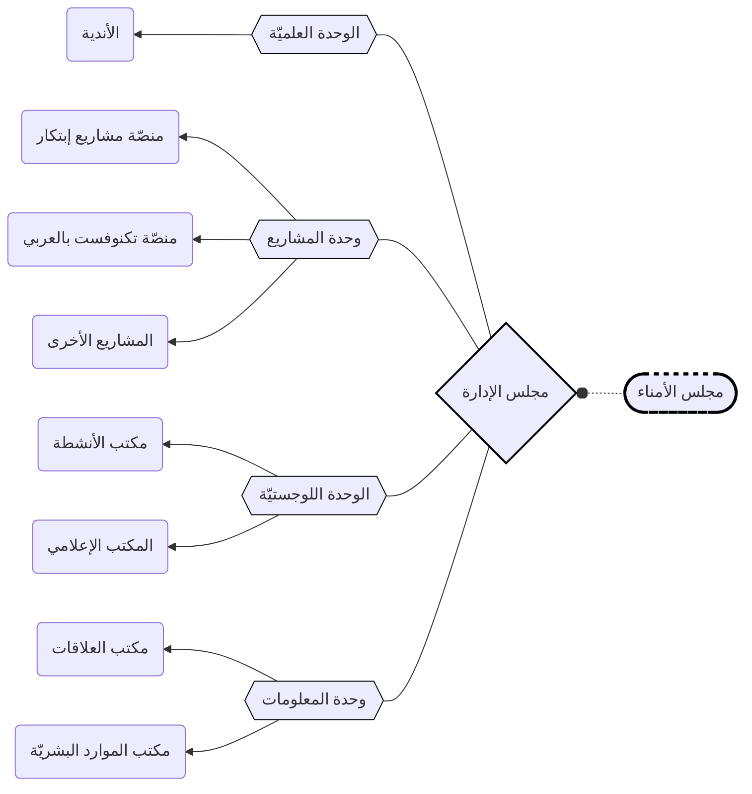
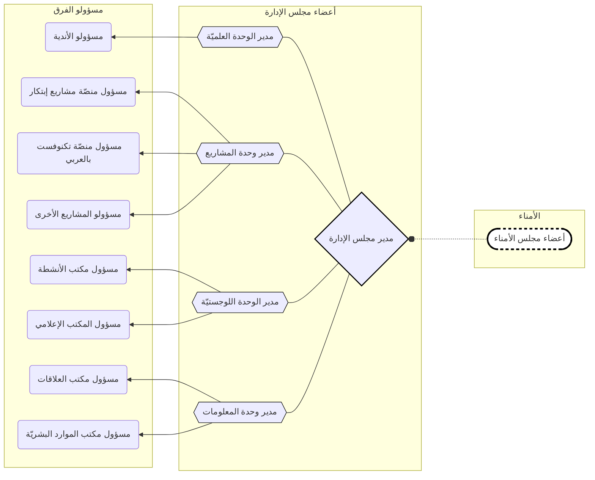

---

### تجمّع إبتكار - النّظام الدّاخلي

- هذا المجلّد يحتوي على ملفّات النّظام الدّاخلي لتجمّع إبتكار
- رابط هذا النظام الداخلي: 

## ملحقات النظام الداخلي
- الملف التعريفي:   
-  أسئلة شائعة: 
-  منصّة تكنوفست بالعربي: 

## المعرفات الرسمية للتجمع

## المحتوى
| اضغط للوصول | الباب |
| :---- | :---- |
| [هوية التجمّع](#1-الباب-الأول-هويّة-التجمع) | `الباب الأوّل` |
| [مواد النّظام العامّة](#2-الباب-الثّاني-مواد-النّظام-الدّاخلي) | `الباب الثّاني` |
| [هيكليّة التجمّع](#3-الباب-الثّالث-هيكليّة-التجمع) | `الباب الثّالث` |
| [العضويّة](#4-الباب-الرّابع-العضويّة) | `الباب الرّابع` |

# `1` الباب الأول: هويّة التجمع

### البند الأول: التّعريف
  - **التّعريف نصّاً**:
    - تجمّع إبتكار هو فريق تطوّعي يجمع طلّاب الجامعات النّاطقين بالعربيّة، المهتميّن بالابتكار والتّكنولوجيا والبحث والتّطوير، فيسعى لتمكينهم وإغناء خبراتهم التّقنيّة من خلال فعاليات ومشاريع تُلامس حياة الطّالب بدءاً من الحياة الجامعيّة ومروراً بالتّطوير في المجال التّقني والمهارات المجتمعيّة ووصولاً إلى التّخطيط المهني وإدارة المشاريع.
  - **اسم التّجمّع**:
    - باللغة العربيّة: `تجمّع إبتكار التطوّعي`
    - باللغة الانكليزيّة: `Ibtikar Volunteer Assembly`
    - باللغة التركيّة: `İbtikar Gönüllü Topluluğu`

### البند الثّاني: دواعي التّأسيس
- الإيمان بأهمّيّة التّشبيك بين الطلّاب خلال مسيرتهم الدراسية من أجل تطوير مهاراتهم وتعزيز خبراتهم
- نقص مهارات الطلاب في العمل الجماعي وإيجاد حلول مبتكرة
- الإيمان بأهمّيّة نشر ثقافة التّطوّع والعمل المجتمعي في الأوساط الطلابية
- الحاجة لتشكيل وعي تِقَني عند المجتمع الناطق بالعربية

### البند الثّالث: رؤيتنا
- مجتمع رائد في بناء شباب واعي، مُبتكر للحلول، وذو تأثير اجتماعي

### البند الرّابع: رسالتنا
- استثمار الجهود وتنسيقها بين الطلاب لتطوير مهاراتهم التقنيّة وتحفيز الابتكار والإبداع لديهم، وتعزيز فعاليّتهم في خدمة المجتمع وتقدّمه

### البند الخامس: أهدافنا
1. تفعيل التواصل الهادف في المجتمع الشبابي التِقَني
2. تطوير المهارات التقنيّة والتّحفيز على الابتكار والإبداع في حل المشاكل وبناء المشاريع
3. ترسيخ الدور المجتمعي للطلاب في واقعهم
4. زيادة فرصة الطلاب العرب في إنشاء المشاريع والمشاركة في المسابقات التقنيّة
5. ظهور مشاريع ناجحة لطلّاب عرب على السّاحة

### البند السّادس: قِيَمُنا
- `الإحسان`
- `الجودة`
- `الإبداع`
- `التّشارك`
- `الاستقلالية`
 

# `2` الباب الثّاني: مواد النّظام الدّاخلي

### `2.1`	البند الأوّل: المواد الرّئيسيّة
- `2.1.1`	تجمّع إبتكار يعمل لأهداف مجتمعيّة، لا يمكن استخدام التجمّع لأهداف شخصيّة
- `2.1.2`	يستهدف تجمّع إبتكار الجمهور العربي بشكلٍ خاص، والمسلم بشكلٍ عام
- `2.1.3`	تجمّع إبتكار لن يتواجد في أي فعاليّة تخالف معايير الدّين الإسلامي
- `2.1.4`	المواد `2.1.1` – `2.1.2` – `2.1.3` هي مواد صلبة لا يمكن تغييرها

### `2.2`	البند الثّاني: قيود المواد الرّئيسيّة
- `2.2.1`	لا يمكن لأي عضو مخالفة المواد الرئيسيّة مهما كان منصبه
- `2.2.2`	كل من المواد `2.1.4` – `2.2.1` – `2.4` – `3.2.1` هي مواد صلبة لا يمكن تغييرها

### `2.3`	البند الثّالث: أعضاء التّجمّع
- `2.3.1`	شرط العضويّة؛ يجب على كل شخص أن يحقّق إحدى هذه الشّروط لكي ينتسب للتّجمّع:
  - أن يكون طالب جامعي في تركيا أو سوريا
  - أن يكون متخرّج من جامعة تركيّة أو سوريّة وعمره لا يتخطّى الـ `30 سنة`
  - أن يكون متخرّج من جامعة تركيّة أو سوريّة منذ مدّة لا تتخطّى السّنتين
- `2.3.2`	كل من يملأ استمارة الانتساب يوقّع على ميثاق الانضمام بشكل الكتروني ويصبح عضو في التّجمّع إذا كان يحقّق الشّروط وكانت معلوماته صحيحة
- `2.3.3`	يترتّب على جميع الأعضاء الالتزام بالنّظام الدّاخلي
- `2.3.4`	مخالفة النّظام الدّاخلي قد تعرّض العضو لإلغاء العضويّة، وذلك موضّح في المادّة `4.4.1`
- `2.3.5`	المزيد من التفاصيل حول العضوية موضّحة في الباب الرّابع

### `2.4`	البند الرّابع: الهيئة التّأسيسيّة
- `2.4.1`	هي الهيئة التي قامت بتأسيس التّجمّع وصاغت النّظام الدّاخلي
- `2.4.2`	تتكوّن الهيئة التّأسيسيّة من مؤسّسي التجمّع وعددهم واحد (عبد الكريم لحموني)
- `2.4.3`	مهمّة الهيئة التّأسيسيّة هي صياغة النّظام الدّاخلي للتّجمّع
- `2.4.4`	الهيئة التّأسيسيّة هي عضو دائم في مجلس الأمناء، وتمتلك حقّ النّقد فيه
- `2.4.5`	تفقد الهيئة التّأسيسيّة حقّ إعادة صياغة النّظام الدّاخلي في التّجمّع بعد 4 (أربع) سنوات من تاريخ التّأسيس (2022.10.05)

### `2.5`	البند الخامس: فعاليات التجمع
- `2.5.1`	يحتوي تجمع إبتكار على العديد من النوادي والمشاريع (الوحدة العلمية)، كل منها يعمل بشكل منفصل على فعاليات مختلفة
- `2.5.2`	يتمّ تنظيم مشاريع أو فعاليات من قبل الوحدة العلمية بناءً على أهداف التّجمّع ورؤيته
- 

# `3` الباب الثّالث: هيكليّة التجمع

## `3.1` البند الأوّل: سلّم الهيكليّة
### `3.1.1`	سلّم الهيكليّة العامّة

### `3.1.2`	سلّم الهيكليّة الإداريّة

 
 
## `3.2` البند الثّاني: البنية الإداريّة

### `3.2.1`	مجلس الأُمناء
- **`3.2.1.1` تعريف مجلس الأمناء**:
    - هو المجلس الأساسيّ المسؤول عن التّجمّع، يعيّن رئيس مجلس الإدارة ويراقب عمل الإدارة
- **`3.2.1.2` أعضاء مجلس الأمناء**:
    - يتكوّن مجلس الأمناء من مؤسّس التّجمّع والأعضاء الذين تمّ تعيينهم
- **`3.2.1.3` آليّة تشكيل مجلس الأمناء**:
    - يتمّ تعيين أعضاء جدد في مجلس الأمناء من قبل الأعضاء الموجودين بالمشورة
- **`3.2.1.4` مهام مجلس الأمناء**:
    - تعيين رئيس مجلس الإدارة والإشراف على عمل الإدارة
    - تقديم المشورة لمجلس الإدارة
    - تغيير مواد النّظام الدّاخلي إذا لزم الأمر، ويكون ذلك بالمشورة
    - يحق لأعضاء مجلس الأمناء فصل أعضاء مجلس الإدارة في حال حدوث مخالفة للمواد الرّئيسيّة المذكورة في البند `2.1` من النّظام الدّاخلي، ويكون ذلك بالمشورة
- **`3.2.1.5` قيود مجلس الأمناء**:
    - يقوم مجلس الأمناء بتعيين رئيس مجلس الإدارة، ولكنّه لا يتدخّل بشكل مباشر بعمل مجلس الإدارة
    - لا يمكن لمجلس الأمناء اتّخاذ قرارات إداريّة في التّجمّع
    - لا يمكن لمجلس الأمناء تغيير رئيس مجلس الإدارة دون مرور دورة واحدة على الأقل (إلّا في حال مخالفة المواد الرّئيسيّة `2.1`، واتّخاذ قرار الفصل)

### `3.2.2`	مجلس الإدارة
- **`3.2.2.1` تعريف مجلس الإدارة**:
  - هو المجلس الذي يُدير تجمّع إبتكار بشكل كامل
- **`3.2.2.2` أعضاء مجلس الإدارة**:
  - يتكوّن مجلس الإدارة من رئيس مجلس الإدارة ومديري الوحدات الإداريّة (1+4)
- **`3.2.2.3` آليّة تشكيل مجلس الإدارة**:
  - يتمّ تعيين رئيس مجلس الإدارة من قبل مجلس الأمناء
  - يتمّ تعيين مديري الوحدات من قبل رئيس مجلس الإدارة نفسه
  - يتمّ تجديد هذه التّعيينات في كلّ دورة
- **`3.2.2.4` مهام مجلس الإدارة**:
  - وضع خطط مستقبليّة ضمن رؤية التّجمّع وتنسيقها مع متطوّعي الوحدات
- **`3.2.2.5` قيود مجلس الإدارة**:
  - لا يمكن لمجلس الإدارة تعيين أعضاء في مجلس الأمناء
  - لا يمكن تغيير أي من أعضاء مجلس الإدارة دون مرور دورة واحدة على الأقل (إلّا في حال مخالفة المواد الرّئيسيّة `2.1`، وفصله من قبل مجلس الأمناء، أو في حال عدم تأدية مهمّته بالشّكل اللازم)
  - 
## `3.3`	البند الثّالث: المهام الإداريّة
### `3.3.1`	رئيس مجلس الإدارة
- تمثيل تجمّع إبتكار وأعضائه رسميّاً أمام كلّ الجهات
- تعيين مدراء الوحدات الإداريّة والإشراف على عملهم
- وضع خطط مستقبليّة ضمن رؤية التّجمّع وتنسيقها مع الوحدات
### `3.3.2`	مدراء الوحدات الإدارية
- تعيين أعضاء الوحدة وتوزيع المهام بينهم ومتابعتهم بشكل مستمر
- توزيع عمل الأعضاء على أساس احتياجات الوحدة
- متابعة التّطوّرات الإداريّة وتنسيق مهام أعضاء الوحدة على أساسها

## `3.4`	البند الرّابع: شروط التّطوّع للمهام الإداريّة
### `3.4.1`	رئيس مجلس الإدارة
- يجب أن يكون صاحب رؤية ومبادئ
- يجب أن يكون متفرّغاً وقادراً على تحمّل ضغط عمل كبير
- يجب أن يمتلك شخصيّة قياديّة وإداريّة، ويمكنه اتّخاذ قرارات صعبة بحكمة
- يجب أن يكون لديه معرفة تقنيّة عالية ويؤمن بمستقبل تقني
- يجب أن يكون قادراً على النّيابة عن جميع أعضاء مجلس الإدارة إذا لزم الأمر
### `3.4.2`	مدراء الوحدات الإدارية
- يجب أن يكون أكثر شخص مهتمّ في الوحدة، وهو قادر على تحمّل ضغط عمل كبير
- يجب أن يكون لديه معرفة تقنيّة عالية ويؤمن بمستقبل تقني
- يجب أن تكون لديه القدرة على إدارة المتطوّعين وتوزيع المهام بينهم
- يجب أن يكون قادراً على النّيابة عن جميع أعضاء الوحدة إذا لزم الأمر

# `4` الباب الرّابع: العضويّة

### `4.1`	البند الأوّل: أنواع العضويّة

- **`4.1.1`	عضو عام**:
  - كل عضو منتسب إلى تجمّع إبتكار
- **`4.1.2`	عضو فعّال**:
  - كل عضو منتسب إلى تجمّع إبتكار، ومتطوّع خلال الدّورة الحاليّة

### `4.2`	 البند الثّاني: حقوق وواجبات كل نوع من العضويّة:

#### `4.2.1`	الحقوق:

- **`4.2.1.1`**	حقوق العضو العام:
  - أ‌.	الأولويّة _عن غير المنتسبين_ في المشاركة والاستفادة من الفعاليّات والخدمات التي يقدّمها التجمّع
  - ب‌.	حقّ التّطوّع للمهام المتاحة
- **`4.2.1.2`**	حقوق العضو الفعّال:
  - الأولويّة _عن العضو العام_ في المشاركة والاستفادة من الفعاليّات والخدمات التي يقدّمها التجمّع
  - حقّ التّطوّع للمهام المتاحة
  - الحصول على شهادة تطوّع بالأعمال التي قام بها في حال طلبه ذلك
- 
#### `4.2.2`	الواجبات:
- **`4.2.2.1`**	واجبات العضو العام:
  - الالتزام بميثاق الانضمام في تجمّع إبتكار
  - التّواجد ضمن مجموعة الأعضاء في الواتسآب
  - تحديث البيانات الشخصيّة كل فترة (يتمّ تحديد هذه الفترة من قبل الإدارة)
  - تزكية تجمّع إبتكار عند الجهات التي له علاقة بها
- **`4.2.2.2`**	واجبات العضو الفعّال:
  - الالتزام بميثاق الانضمام في تجمّع إبتكار
  - التّواجد ضمن مجموعة الأعضاء في الواتسآب
  - تحديث البيانات الشخصيّة كل فترة (يتمّ تحديد هذه الفترة من قبل الإدارة)
  - تزكية تجمّع إبتكار عند الجهات التي له علاقة بها
  - التّطوّع والمساعدة في إنجاز المخطّطات ضمن التّقسيمات الإداريّة المتواجد ضمنها
  - الالتزام بالمهام المكلّف بها ضمن المكتب/النادي/المشروع الذي ينتسب له

### `4.3`	البند الثّالث: تغيير نوع العضويّة
- **`4.3.1`**	من العضو الفعّال إلى العضو العام:
  - يتحوّل العضو الفعّال إلى عضو عام في حال لم يحقّق الشّروط في المادّة `4.2.2.2`
- **`4.3.2`**	من العضو العام إلى العضو الفعّال:
  - يتحوّل العضو العام إلى عضو فعّال في حال سجّل على أحد المهام المتاحة عبر منبر المتطوّعين، وتمّ قبوله

### `4.4`	البند الرّابع: إلغاء العضويّة
#### `4.4.1`	من قبل الإدارة:
- تقوم الهيئة الإداريّة بإلغاء عضويّة أي عضو في الحالات الآتية:
  - مخالفة النّظام الدّاخلي
  - الإساءة للأعضاء الآخرين، مهما كان نوع الإساءة
  - إلحاق الضّرر بالتّجمّع بشكل متعمّد، مهما كان نوع الضّرر
  - عدم الالتزام بالواجبات/المهام المكلّف بها
#### `4.4.2`	من خلال طلب العضو:
- يمكن لأي عضو تقديم طلب إلغاء العضويّة لمسؤول مكتب الموارد البشريّة، يوضّح فيه أسباب طلبه، ويُلغي بذلك عضويّته في التّجمّع
#### `4.4.3`	من خلال عدم تجديد العضوية:
- على جميع أعضاء التّجمّع تجديد عضويّاتهم وبياناتهم كل فترة (يتمّ تحديد هذه الفترة من قبل الإدارة). من لا يقوم بتجديد عضويّته يكون بذلك قد ألغى عضويّته

### `4.5`	البند الخامس: توزيع الأعضاء
- **`4.5.1`**	يتم فرز جميع الأعضاء في الأجنحة (مجموعات دردشة تجمع طلاب التخصصات المتقاربة)
- **`4.5.2`**	كل عضو يتواجد في جناح واحد فقط
- **`4.5.3`**	توزيع الأجنحة:
  - جناح المعلوماتية
  - الجناح الصّناعي
  - جناح العلوم الطبيعيّة
  - جناح الإدارة والفنون
